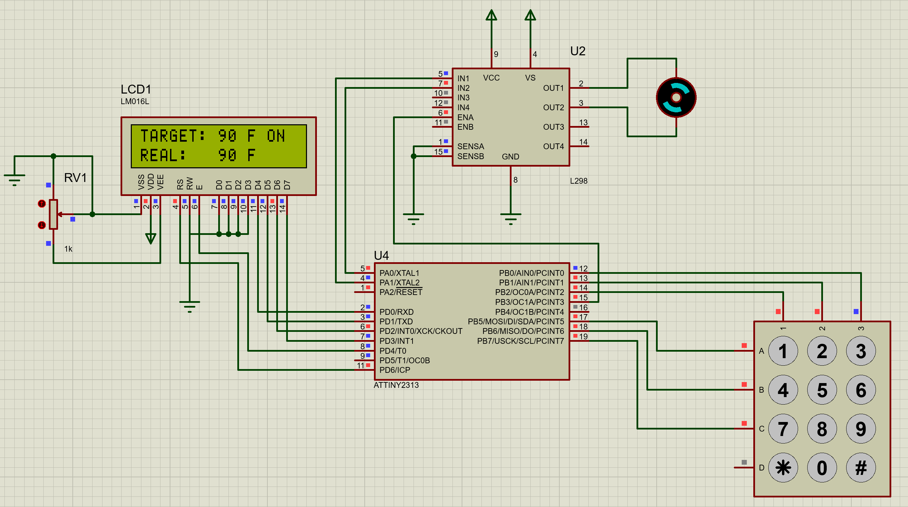

Для задания:
Собрать схему и составить программу управления скоростью мотора постоянного тока с помощью матричной клавиатуры (3х3). Скорость и направление вращения задается нажатием кнопок или их сочетанием. Мотор приводится в движение при помощи микросхемы L298 или аналогичной.

Из особенностей - использован самый бомж МК (attiny2313), который для этой задачи вообще возможен (attiny13 ещё хуже, но там надо сдвиговые регистры прикрутить), и минимально возможная частота контроллера - 16 кГц

For the task:
Assemble a circuit and write a program to control the speed of a DC motor using a matrix keyboard (3x3). The speed and direction of rotation are set by pressing buttons or a combination of them. The motor is driven by an L298 chip or similar.

Among the features - the most bum MK is used (attiny2313), which is generally possible for this task (attiny13 is even worse, but shift registers need to be screwed in there), and the minimum possible controller frequency is 16 kHz

